# Estimation of Sales Revenue based on Advertisement Budgets across various channels 

## Problem statement
This project aims to build a predictive model that estimates sales revenue using advertising expenditure across multiple channels. The dataset contains historical records of sales performance, marketing spend, and campaign initiatives across diverse media. It serves as a resource for evaluating advertising strategies, running A/B tests, optimizing marketing budgets, and forecasting future revenue trends. 

The goal is to select the best regressor ML model out of many (3) models, found by tuning few of its hyperparameters, to predict the target OR expected sales revenue for the budget spent as advertisements across 4 channles namely: TV, Radio, Social Media & Influencers. The chosen model and its environment can be hosted as a containerized web app which is built using python, uv, FastAPI, Docker in any cloud instance (fly.io is used in the report) which provides a sales revenue estimate as a response.

**DISCLAIMER**: The domain of this project and its resources are purely intended for learning purposes. The models generated out of this project are not recommended to be deployed in any company specific applications.

## Project deliverables
* uv based production env with 3 files (`train.py`, `serve.py`, `predict.py`) and associated module dependencies
* `Dockerfile` with uv production environment to create a docker image and deploy docker container
* python jupyter notebook named as modeling.ipynb, from which the `train.py` script was generated (for a usable evaluation and reference)
* The best model in binary format (.bin) --> for inference, named as `pickled_model.bin`
* python dictionary vectorizer in binary format (.bin) --> to transform the features of the incoming inference data, named as `dictvectorizer_fulltrain.bin`
* `README.md` file that summarizes the project

## Dataset source link
https://www.opendatabay.com/data/consumer/4b610cec-3779-4e8b-b57c-2e1b8cbc906b

## EDA

***Distribution of the target variable - sales revenue in $***

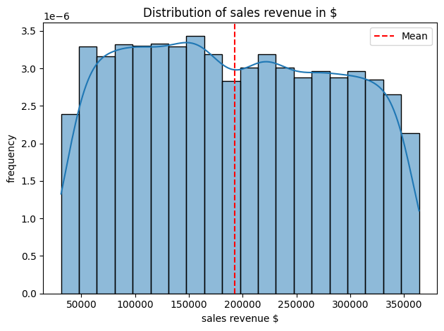


***Distribution of the categorical feature - influencer***

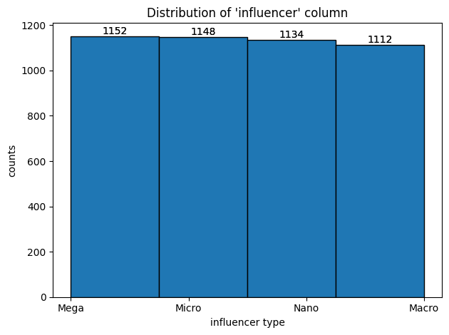


***Distribution of numerical features - tv, radio, social_media***

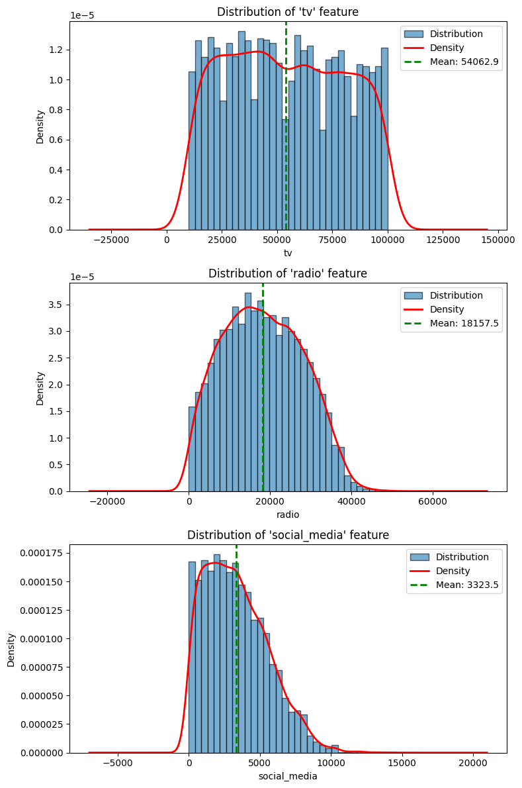

***Correlation matrix of numerical features - tv, radio, social_media***

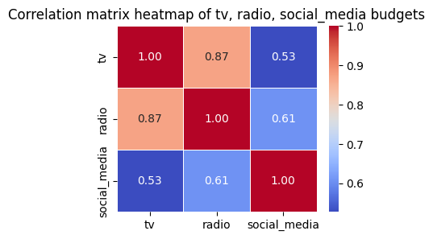

***Pair plots of numerical features - tv, radio, social_media***

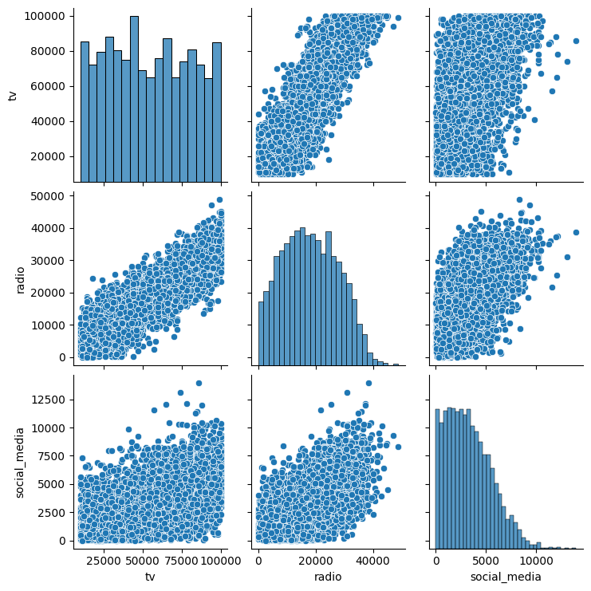

***Determining feature importances - comparison of features with the target variable***

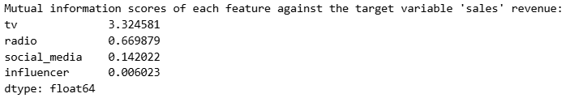


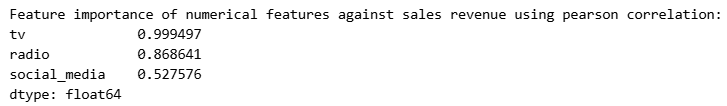


***Finalized features and # of records***

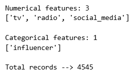


## Training the models

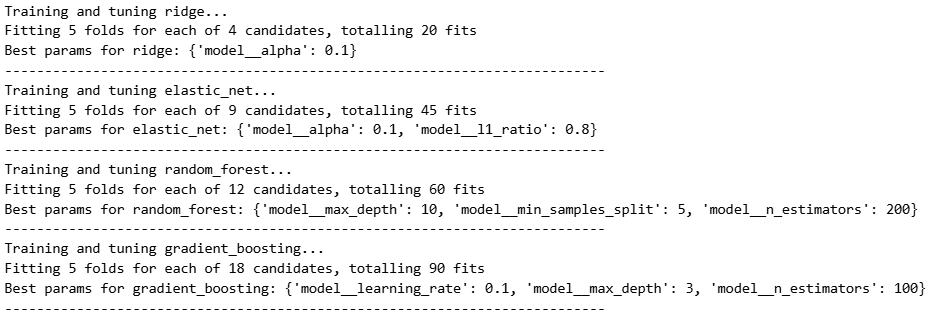

## Predictions and evaluations

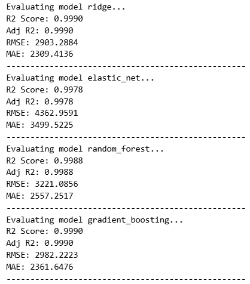

***Evaluation metrics across the best models of different regressors:*** 

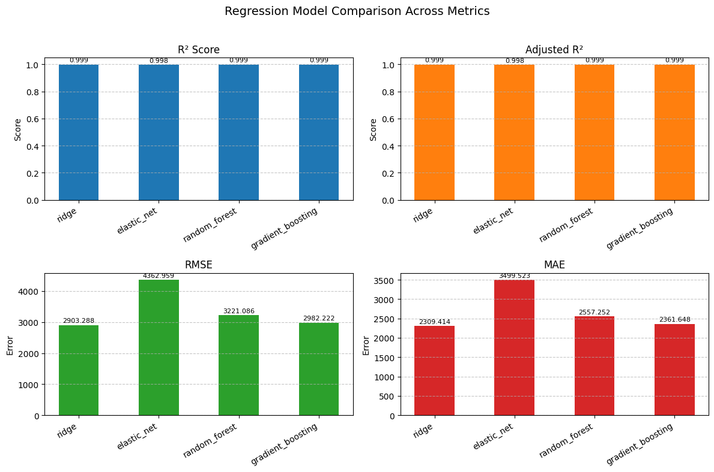


## Best model

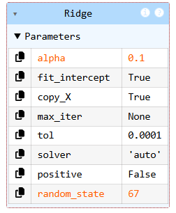


## Feature importances

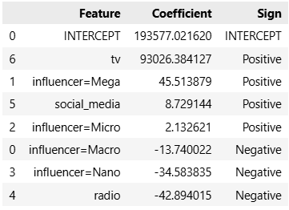

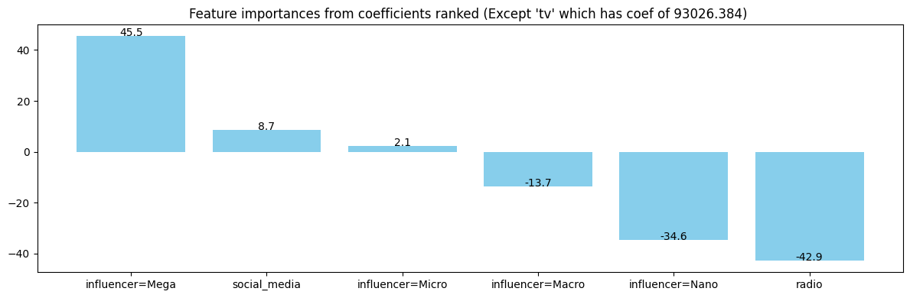

## Model deployment

### Converting the notebook into script

`jupyter nbconvert --to script eda_and_modeling.ipynb --output production/train.py`


### pyproject.toml describing dependencies required in local env (equivalent to requirements.txt)
```
[project]
name = "sales-prediction-production"
version = "0.1.0"
description = "Estimation of Sales Revenue based on Advertisement Budgets across various channels"
readme = "README.md"
requires-python = ">=3.13"
dependencies = [
    "fastapi>=0.128.0",
    "matplotlib>=3.10.8",
    "numpy>=2.4.0",
    "pandas>=2.3.3",
    "pydantic>=2.12.5",
    "requests>=2.32.5",
    "scikit-learn>=1.8.0",
    "seaborn>=0.13.2",
    "uvicorn>=0.40.0",
]

[dependency-groups]
dev = [
    "requests>=2.32.5",
]
```

### Creating a virtual environment and dependency management

```
# everything done inside the production folder 
python pip install --upgrade pip

pip install uv

# adding dependencies (can also add from requirements.txt file)
uv add numpy pandas matplotlib seaborn scikit-learn fastapi uvicorn requests pydantic

# adding developer dependencies
uv add --dev requests

# install dependencies
uv sync

# running the python script using the local env created with dependencies 
uv run python train.py

# if you had activated virtual env using  source .venv/bin/activate or .venv\Scripts\Activate.ps1 
# (do it after you complete all operations)
deactivate
```

### Model deployment using FastAPI
* web app created using FastAPI in the `serve.py` script
* please refer `/production/serve.py` for the model and feature vectorizer served as a web service (run it from a terminal #1)
* please refer to `/production/predict.py` for how the web service is pinged (ping the service from another terminal #2)
* 200 OK output from terminal #1
* response from prediction as output in terminal #2

**Terminal #1:**

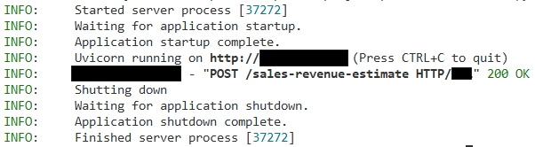

**Terminal #2:**

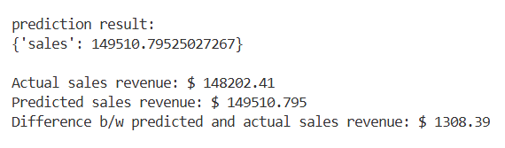

### Dockerfile to create an image in order to serve the model in a container
```
# base image
FROM python:3.13-slim

# for uv virtual environment container
COPY --from=ghcr.io/astral-sh/uv:latest /uv /uvx /bin/

# working directory
WORKDIR /code

ENV PATH="/code/.venv/bin:$PATH"

COPY "pyproject.toml" "uv.lock" ".python-version" ./

# sync the virtual env and install necessary dependencies
RUN uv sync --locked

# copy the raw data to train 
COPY data/ ./

# copy the pickled best model (OPTIONAL - it is not must, if you run the train.py in the container before serve.py)
COPY "pickled_model.bin" ./

# copy the dict vectorizer fitted on full training data (OPTIONAL - it is not must, if you run the train.py in the container before serve.py)
COPY "dictvec_fulltrain.bin" ./

# copy the training script
COPY "train.py" ./

# copy the serving script
COPY "serve.py" ./

# exposing the port of the container to serve the app
EXPOSE #

# using the serve script as the entrypoint and the exposed port
ENTRYPOINT ["uvicorn", "serve:app", "--host", "#.#.#.#", "--port", "#"]
```

### Running and managing a docker container that serves the model using docker commands and fetching predictions
```
# build the image
docker build -t sales-revenue-estimation:1.0 .

# run a container from the image built
docker run -p ####:#### --name sales-revenue-estimation-web-app sales-revenue-estimation:1.0

# check if container is running
docker ps 

# from client side: run the predict script to fetch a prediction response
uv run python predict.py
```

### Cloud deployment of the model serve from a docker container using fly.io
```
# if you have not installed, install the fly.io locally
curl -L https://fly.io/install.sh |sh

# login to your fly.io account
flyctl auth login

# change directory to production folder and launch an app
flyctl launch --name sales-revenue-####-####

# deploying the docker container from the local docker image built from Dockerfile
flyctl deploy --image insulin-dosage-recommendation:1.0

# retrieve the url you need to test from command line
flyctl apps list

# the app is served in the following url:
# NOTE: this URL no longer exists
# https://insulin-dosage-###-###-###-###.fly.dev

# IMPORTANT: stop the web app and completely remove it using the following commands
flyctl machine stop --app sales-revenue-####-####
flyctl apps destroy sales-revenue-####-#### --yes
```
**Model served:**

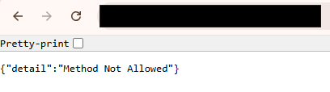

**Response received:**

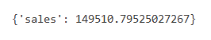

* to make the predictions when the containerized model is served in fly.io change the url in `predict.py` from the client to reach out correctly
* now run `uv run python predict.py` to reach out the fly.io app serving containerized model to fetch response 
* the response from the cloud deployed container will be received in the terminal that runs `uv run python predict.py`
* IMPORTANT: make sure you stop the web app and remove it using the final 2 commands in the code given above

## Results

| Rank | Regression Model          | RMSE   | MAE    | R²     | Verdict                  |
|------|----------------|--------|--------|--------|--------------------------|
| 🥇   | **Ridge**      | **2,903** | **2,309** | **0.9990** | **Simplest + Interpretable** |
| 🥈   | **Gradient Boost**         | 2,982 | 2,362 | 0.9990 | Second best + robust     |
| 🥉   | **Random Forest**         | 3,221  | 2,557  | 0.9988    | Solid tree ensemble      |
| 4th  | **Elastic Net**    | 4,363  | 3,500  | 0.9978    | Still good, but beaten  |

**Reasons for selecting Ridge regression model for production:**
1. the Ridge regression outperforms other models across all metrics 
2. the coefficients of Ridge are much simpler to interpret
3. the model itself is lightweight and can be hosted efficiently

* validation using test set confirms generalization (no overfitting) of the selected tuned Ridge regression model
* Metrics on test set: **R² Score: 0.9990**, **MAE: 2334.6839**, **RMSE: 2930.1586**

**Key assumptions and details:**
- the data set used to train had uniform or normal distributions of the numerical features and almost balanced categorical features
- The range of values in each of the advertisement channels budgets with numerical features are as follows: 
    - tv: MIN --> $10,000 approx. | MAX --> $100,000 approx.
    - radio: MIN --> $0.68 approx. | MAX --> $48,871 approx.
    - social media: MIN --> $0.03 approx. | MAX --> $13,982 approx.
- the above given ranges of each feature provides a picture for what type of budgets, the current selected model be used for

**Interpreting the coefficients and intercept from the tuned ridge regression model:**
* Top 3 Advertisements channels (coefficients) : 
1. tv (93026 approx.)
2. Mega influencers (45.51 approx.)
3. Social media (8.73 approx.)

* Negative channels (coefficients):
1. radio (-42.89 approx.)
2. Nano influencers (-34.58 approx.)
3. Macro influencers (-13.74 approx.)

**Interpret the intercept with caution**
* Intercept (193577 approx.) represents baseline performance without any advertisement budgets
* this is to be taken with caution because of the data used to train the model

## Conclusion
- from the $193,577 from intercept without spending money on ads + the coefficient of tv being exorbitantly high + the minimum tv budget used in the training data indicates --> this model suits companies who heavily invest in ads (especially tv ads)
- Budget allocation based on this model:
    - safe: TV, Mega influencers, social media advertisements
    - monitor: Micro, Macro influencers ad performance
    - avoid: radio, Nano influencers entirely

**Future steps and Risks to handle:**
- Validate coefficients of the model by consulting professionals and SMEs based on domain of businesses, scale of investment, content of the ads etc.  
- Interaction effects of the current features needs to be studied
- Do we need more granularity of each of the features in the given dataset to explore and build better interpretable model that can inform marketing team's decisions?
- Monitoring model drift by setting estimates from targets and using the feedback for improvements
- Consult with the marketing team to check if they need a more accurate but non-interpretable (black box) model that can be built using more granular and auxillary data

> **IMPORTANT REMINDER** --> Please make sure you have closed the web app if it is hosted and running in terminal OR docker OR cloud


# SPECIAL NOTE
Thanks to ML zoomcamp team, datatalks club team and all my peers!
