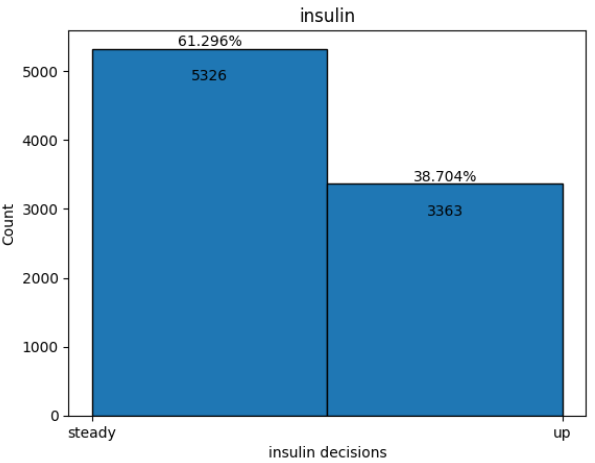
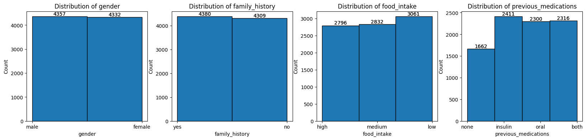
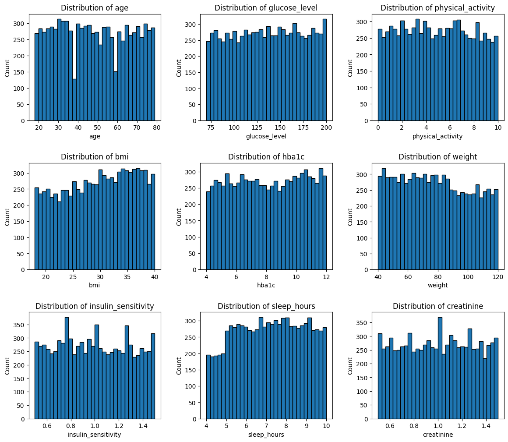
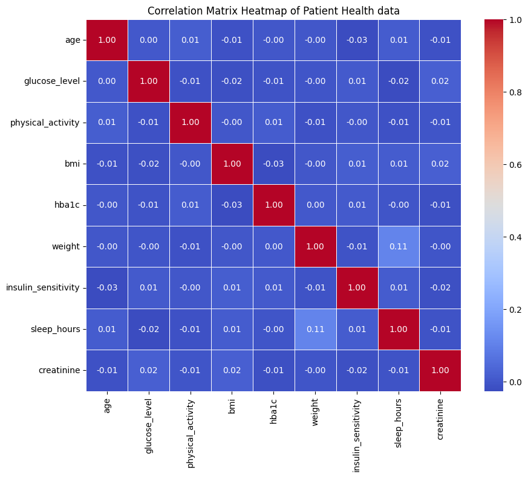
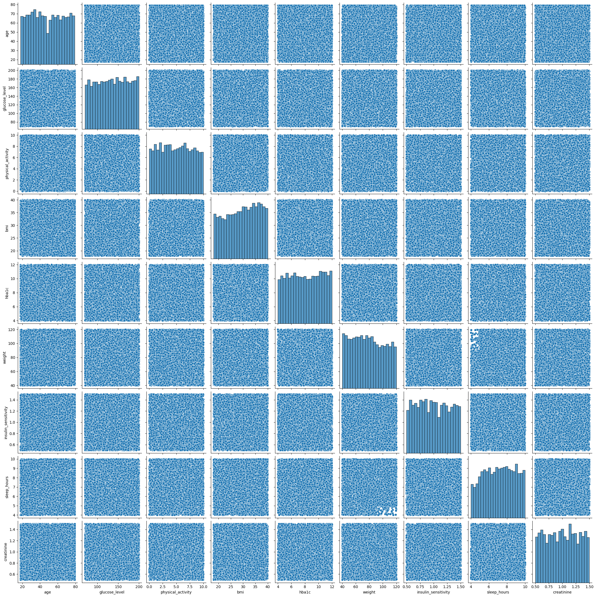
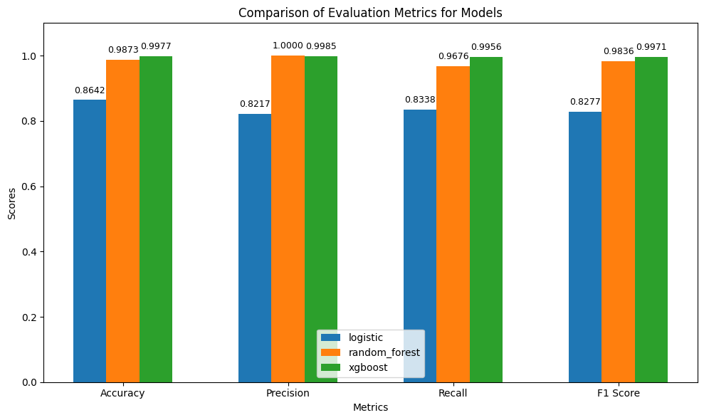
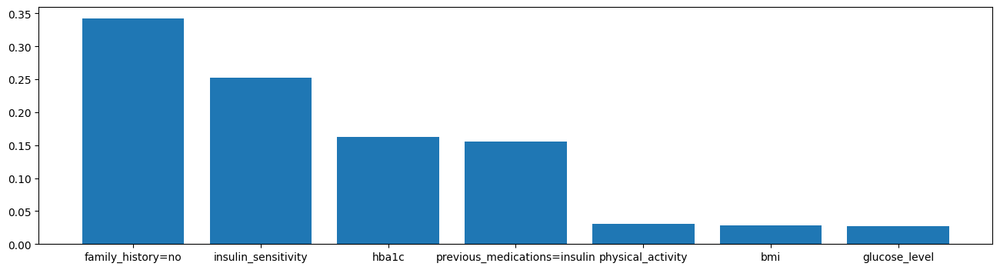
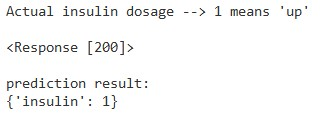

# Binary Class Prediction of Insulin Dosage Recommendation Evaluated from Patient Health Data
<br>

#### IMPORTANT INSTRUCTIONS:
1. **/production** folder is the virtual environment with **train.py**, **serve.py**, **predict.py**
<br>
<br>
2. **modeling.ipynb** is the same as 'train.py' but in a python jupyter notebook. You can run it other than **train.py** if you need a user friendly interface
<br>
<br>
3. the **/production** environment is created and dependencies are created using **uv**. it is reproducible 
<br>
<br>
4. If you plan on running the model in your own environment, along with the entire folder make sure you do the following
    <br>
    (A) in **serve.py** add the IP and port you wish to serve the model from 
    <br>
    (B) in **predict.py** add the port at which the request is POSTed in the IP (or) localhost
<br>
<br>
5. If you plan to run by creating a docker image and making the inference from it:
    <br>
    (A) **follow the same steps in Instruction 4**
    <br>
    (B) edit the **Dockerfile** to mention the host IP and expose the port you need to send the json for prediction
<br>
<br>
6. If you wish to serve it as a webapp:
    (A) you can export the docker image and serve it in **fly.io** or codespaces or any cloud platform instances
        <br>
        (but make sure to make changes in the serve.py predict.py Dockerfile to serve in the appropriate IP and port)
    <br>
    (B) unfortunately there is NO live web app serving requests at this moment
<br>
<br>
7. Requirements:
    <br>
    (A) **python 3.13**
    <br>
    (B) **Docker**
    <br>
    (C) any cloud service with an instance to host the container
<br>
<br>
<br>

## PROBLEM STATEMENT:
Accurately determining the appropriate insulin dosage for patients with diabetes is a critical component of effective disease management and prevention of complications such as hypoglycemia or hyperglycemia. The complex and heterogeneous nature of patient health data include factors such as: biomarkers, lifestyle factors, and medical history. Thus, a clinician or a medical profession may benefit from an accessory machine assisted evaluation to compare their expertise against.

The scope of this project is to choose a best **binary classifier ML model** out of many (3), found by tuning few of its hyperparameters, to recommend whether to increase or keep the same dosage previously prescribed by the doctor. This model and its environment can be hosted as a containerized web app which is built using **python, uv, FastAPI, docker** in any cloud instance (**fly.io** is used by myself) to elicit a response (a binary recommendation with additional details).

Performance of the models will be evaluated and judged based on standard classification metrics: **accuracy, precision, recall, F1-score**.

__**DISCLAIMER:**__ the nature of this project and its results are purely for learning purposes. The models generated out of this project are not recommended for any medical applications whatsoever since no clinical / medical professionals were consulted in the course of its creation.  

<br>

## PROJECT DELIVERABLES:
* Production environment with 3 files (**train.py**, **serve.py**, **predict.py**) and associated module dependencies
<br><br>
* **Dockerfile** that can use the production environment to create a image and deploy containers on the web
<br><br>
* python jupyter notebook named as **modeling.ipynb**, from which the 'train.py' script was generated (for a usable evaluation and reference)
<br><br>
* The best model in binary format (.bin) --> for inference, named as **pickled_model.bin**
<br><br>
* python dictionary vectorizer in binary format (.bin) --> to transform the incoming inference data, named as **dictvec_fulltrain.bin**
<br><br>
* short summarized report (the **README.md** file that you are currently viewing)

<br>

## DATA SOURCE:
https://www.kaggle.com/datasets/robyburns/insulin-dosage

<br>

## EDA and FEATURE SELECTION:
Distribution of the target variable (to understand balance/imbalance of the data at hand):
<br>

<br><br><br>
Distribution of categorical features (to understand the nature of categorical features):
<br>

<br><br><br>
Mutual information scores of categorical features against the target:
<br>
```
family_history          0.102997
previous_medications    0.054533
food_intake             0.000255
gender                  0.000003
```
<br><br><br>
Distribution of numerical features (to understand the nature of numerical features):
<br>

<br><br><br>
Correlation heatmap of all numerical features (feature-feature correlation check):
<br>

<br><br><br>
Pairplot of all numerical features (feature-feature correlation check):
<br>

<br><br><br>
Correlation (pearson) between each numerical feature and the target (feature-target correlation check):
<br>
```
insulin_sensitivity    0.382687
hba1c                  0.158881
glucose_level          0.050865
physical_activity      0.044387
bmi                    0.033232
weight                 0.021000
creatinine             0.011322
sleep_hours            0.011231
age                    0.000985
```

__Finalized features:__
<br><br>
Numerical features: 8
<br>
['glucose_level', 'physical_activity', 'bmi', 'hba1c', 'weight', 'insulin_sensitivity', 'sleep_hours', 'creatinine']
<br><br>
Categorical features: 2
<br>
['family_history', 'previous_medications']
<br><br>

Finalized target:
<br>
'insulin'
<br>


## TRAINING, TUNING and EVALUATION:
Training set: __5212__ records (60%)
<br><br>
Validation set: __1738__ records (20%)
<br><br>
Test set: __1738__ records (20%)

### Training and tuning:
```
Training and tuning logistic...
Fitting 5 folds for each of 8 candidates, totalling 40 fits
Best params for logistic: {'model__C': 0.01, 'model__penalty': 'l1'}
--------------------------------------------------
Training and tuning random_forest...
Fitting 5 folds for each of 24 candidates, totalling 120 fits
Best params for random_forest: {'model__max_depth': None, 'model__min_samples_leaf': 1, 'model__min_samples_split': 2, 'model__n_estimators': 100}
--------------------------------------------------
Training and tuning xgboost...
Fitting 5 folds for each of 36 candidates, totalling 180 fits
Best params for xgboost: {'model__gamma': 0, 'model__learning_rate': 0.1, 'model__max_depth': 4, 'model__n_estimators': 100}
```

### Evals:
```
Evaluating model logistic...
Accuracy: 0.8642
Precision: 0.8217
Recall: 0.8338
F1 Score: 0.8277
--------------------------------------------------
Evaluating model random_forest...
Accuracy: 0.9873
Precision: 1.0000
Recall: 0.9676
F1 Score: 0.9836
--------------------------------------------------
Evaluating model xgboost...
Accuracy: 0.9977
Precision: 0.9985
Recall: 0.9956
F1 Score: 0.9971
--------------------------------------------------
```




### Best model:
```
XGBClassifier(base_score=None, booster=None, callbacks=None,
              colsample_bylevel=None, colsample_bynode=None,
              colsample_bytree=None, device=None, early_stopping_rounds=None,
              enable_categorical=False, eval_metric='logloss',
              feature_types=None, feature_weights=None, gamma=0,
              grow_policy=None, importance_type=None,
              interaction_constraints=None, learning_rate=0.1, max_bin=None,
              max_cat_threshold=None, max_cat_to_onehot=None,
              max_delta_step=None, max_depth=4, max_leaves=None,
              min_child_weight=None, missing=nan, monotone_constraints=None,
              multi_strategy=None, n_estimators=100, n_jobs=None,
              num_parallel_tree=None, ...)
```

Feature importances magnitudes in descending order:
```
	Feature	Importance
2	family_history=no	            0.342631
6	insulin_sensitivity	            0.252658
5	hba1c	                        0.162597
9	previous_medications=insulin	0.155241
7	physical_activity	            0.031099
0	bmi	                            0.028316
4	glucose_level	                0.027460
1	creatinine	                    0.000000
3	family_history=yes	            0.000000
8	previous_medications=both       0.000000
10	previous_medications=none	    0.000000
11	previous_medications=oral	    0.000000
12	sleep_hours	                    0.000000
13	weight	                        0.000000
```

Feature importances in descending order:



<br>


##  MODEL DEPLOYMENT:

### Virtual environment creation and dependency management in /production:

commands in cli inside production folder to create :
```
# upgrade pip if needed to the latest version (optional)
python pip install --upgrade pip

# install uv if not installed (optional)
pip install uv

# initiate a virtual environment 
uv init

# add all the dependencies
uv add numpy pandas matplotlib seaborn scikit-learn xgboost fastapi uvicorn requests pydantic

# add the dev dependencies
uv add --dev requests

# after you are done with it (do it after you complete all operations)
deactivate
```
```
dependencies = [
    "fastapi>=0.121.2",
    "matplotlib>=3.10.7",
    "numpy>=2.3.5",
    "pandas>=2.3.3",
    "pydantic>=2.12.4",
    "requests>=2.32.5",
    "scikit-learn>=1.7.2",
    "seaborn>=0.13.2",
    "uvicorn>=0.38.0",
    "xgboost>=3.1.1",
]

dev = [
    "requests>=2.32.5",
]
```

### Model served as a web app 
* web app created usiing FastAPI 
* please refer **/production/serve.py** for the model as a web service (run it from a terminal)
* please refer to **/production/predict.py** for how the web service is pinged (ping the service from another terminal)
* 200 OK from terminal 1
* response and output in terminal 2

### Model served in a Docker container
* please refer the **/production/Dockerfile** for how the docker image is created

Docker commands inside /production:
```
# build the image
docker build -t insulin-dosage-recommendation:1.0 .

# run the container from image
docker run -p ####:#### --name insulin-dosage-recommendation-web-app insulin-dosage-recommendation:1.0

# list all docker processes to check if the container is running
docker ps 

# assuming the models are already trained after running train.py
python predict.py

# the following will be the output
```


* can also access the app using the docker container's exposed IP and port when the prediction is done through modifying **predict.py** script's url variable

### Fly.io hosting the docker container

Inside the production folder (if you use linux):
```
# install the fly.io in local
curl -L https://fly.io/install.sh |sh

# login to your account
flyctl auth login

# cd production (if you are present in a different directory)
flyctl launch --name insulin-dosage-###-###-###-###

# deploying the docker container from the local docker image created from Dockerfile as a web app in fly.io
flyctl deploy --image insulin-dosage-recommendation:1.0

# the app is served in the following url:
# IMPORTANT NOTE: this URL no longer exists
# https://insulin-dosage-###-###-###-###.fly.dev

# IMPORTANT IMPORTANT IMPORTANT: stop the web app and completely remove it
flyctl machines stop --app insulin-dosage-###-###-###-###
 
flyctl apps destroy insulin-dosage-###-###-###-###
```

* modify the **predict.py** file's url variable to the url of fly.io web app to ping for predictions
* once you receive the response
* make sure you stop the web app and completely remove it (using the instructions above)

<br>

## CONCLUSION:
* Under this project's scope, **xG Boost classifier** is the best performer among the 3 candidates namely: logistic regression (linear), Random Forest classifier (tree based ensemble), xG Boost classifier (tree based ensemble)  
* further improvements to the entire ML pipeline needs to be done after consulting with subject matter expert 
* UI for the web app will serve greater purposes across multifunctional teams
* Understanding the level of explainability of the model needed and inference on new data can lead to informed model selection even before fitting the data
* Getting to know where the docker container is orchestrated in a broader web app using kubernetes in the web app architecture can lead to specifically tailored input/output from each scripts  
* this project is simply a starting point and a stepping stone for detailed work that can be carried out later
<br><br>
__IMPORTANT REMINDER -->__ please make sure you have closed the web app if it is hosted and running in terminal OR docker OR cloud
<br>
## SPECIAL NOTE:
Thanks to ML zoomcamp team, datatalks.club team and peers!

